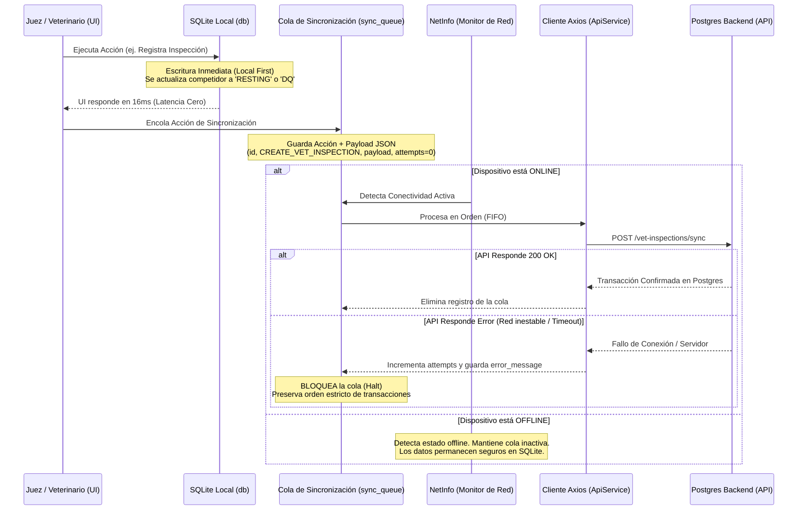

# 📱 EquusCronos Field Mobile - Arquitectura Offline-First

Este documento detalla la estructura base, el diseño técnico y los mecanismos de integridad de datos implementados para **Field Mobile**, la aplicación móvil operativa (React Native + Expo + TypeScript) para oficiales de campo de **EquusCronos**.

---

## 📂 1. Estructura de Carpetas Generada

Bajo el directorio `apps/field-mobile`, se ha inicializado el andamiaje completo del proyecto Expo compatible con **TurboRepo**. La jerarquía de archivos y directorios es la siguiente:

```text
apps/field-mobile/
├── App.tsx                     # Componente raíz con inicialización de DB y ruteo dinámico.
├── app.json                    # Configuración de metadatos y manifiesto de Expo.
├── package.json                # Configuración de dependencias compatibles con el monorepo.
├── tsconfig.json               # Configuración estricta de TypeScript y alias @/*.
├── babel.config.js             # Compilador de JS/TS.
├── metro.config.js             # Configuración de Metro optimizada para workspaces de TurboRepo.
├── assets/                     # Recursos visuales (icon, splash, favicon, etc.).
└── src/
    ├── theme/
    │   └── colors.ts           # Paleta oficial de colores corporativos de EquusCronos.
    ├── database/
    │   ├── schema.ts           # Esquemas DDL SQL de SQLite e interfaces de TypeScript.
    │   └── db.ts               # Conexión, inicialización y seeder inteligente offline.
    ├── services/
    │   ├── ApiService.ts       # Cliente Axios y mapeadores para la API REST del backend.
    │   └── SyncService.ts      # Gestor de cola offline (sync_queue) y estado de red.
    ├── components/
    │   ├── Button.tsx          # Botón de alto contraste y tacto amplio para uso rural.
    │   └── CompetitorCard.tsx  # Tarjeta de visualización dinámica de competidores.
    └── screens/
        ├── TimingScreen.tsx    # Interfaz de cronometraje de milisegundos con offset manual.
        └── VetGateScreen.tsx   # Interfaz clínica veterinaria con reglas de la FEU.
```

---

## 🔄 2. Flujo de Sincronización e Integridad SQLite ➡️ PostgreSQL

La sincronización entre la fuente de verdad local (**SQLite**) y la base de datos central del backend (**PostgreSQL**) se fundamenta en un patrón **Offline-First Transactional Queue**.

### Arquitectura de Sincronización



---

## 🛡️ 3. Garantías Técnicas de Integridad de Datos

Para evitar inconsistencias, registros huérfanos o colisiones de datos durante la sincronización diferida, el sistema implementa **cuatro salvaguardas arquitectónicas**:

### A. Generación de UUIDs del Lado del Cliente (Identidad Descentralizada)

- **Problema:** En el modelo tradicional, el backend Postgres genera las llaves primarias (`ID`) auto-incrementales o por base de datos. Si el dispositivo está offline, no puede obtener un ID asignado, imposibilitando escribir registros vinculados localmente.
- **Garantía:** Tanto `timing_records` como `vet_inspections` generan **UUIDs robustos del lado del cliente** en el instante en que el oficial presiona el botón. Esto permite a la base de datos SQLite enlazar de forma nativa la inspección veterinaria al registro de cronometraje mediante su llave foránea (`timing_record_id`) de manera atómica, mucho antes de que el servidor conozca la existencia de la transacción.

### B. Cola Transaccional Estricta (FIFO) con Bloqueo ante Errores

- **Problema:** Si el cronometrista registra un tiempo de llegada (`ARRIVAL`) y 1 minuto después el veterinario registra un rechazo metabólico (`VET_IN`), el backend de Postgres no puede procesar el rechazo si la llegada no se ha sincronizado aún por fallas en la red intermedia (violación de integridad referencial).
- **Garantía:** El `SyncService` consume la `sync_queue` ordenándola cronológicamente (`ORDER BY id ASC`). **Si la sincronización de un elemento de la cola falla, el proceso de sincronización se detiene (Halt) de forma inmediata**. La aplicación no intentará transmitir ningún registro posterior, garantizando que el historial del competidor se construya en Postgres exactamente en el mismo orden secuencial en que ocurrió en el campo.

### C. Mapeos de Sincronización Idempotentes (Upsert)

- **Problema:** Si un dispositivo envía un registro, el backend lo escribe en Postgres, pero la red móvil se cae antes de que el dispositivo reciba el `200 OK`, el cliente reintentará el envío en el siguiente ciclo de conexión, provocando duplicación de registros de cronometraje o exámenes médicos.
- **Garantía:** El backend procesa las solicitudes a través de un mecanismo de **Upsert** (`ON CONFLICT (id) DO UPDATE`). Dado que el UUID local del registro permanece inalterable en el payload de reintento, Postgres actualizará el registro existente en lugar de duplicarlo, manteniendo el historial limpio e íntegro.

### D. Centralización del Reloj Deportivo (`recorded_at`)

- **Problema:** Un juez toma un tiempo de pista offline a las `14:00:00`. La señal se recupera a las `15:30:00` y sincroniza. Si el servidor central calcula los tiempos en base a la hora de recepción física del paquete en el servidor (`created_at`), el competidor será penalizado erróneamente por horas de demora.
- **Garantía:** La aplicación móvil captura y almacena la hora exacta del reloj local de competencia en la columna `recorded_at` al presionar el botón (con soporte para offset manual para sincronización de cronómetros). Postgres confía estrictamente en este timestamp certificado en el punto de cronometraje, aislando los retrasos de la red móvil de los cómputos deportivos oficiales.

---

## 🐎 4. Integración de Reglas de Negocio de la FEU

Las interfaces operativas se diseñaron para hacer cumplir estrictamente las normas fisiológicas y de marcha dictadas por la **Federación Ecuestre Uruguaya (FEU)**:

### Umbral Frecuencia Cardíaca (Pulsaciones)

- **Umbral Máximo:** Configurado en **56 ppm** como límite reglamentario general de recuperación metabólica.
- **Intento 1 (Vet Gate):** Si el caballo registra $> 56$ ppm en el primer examen, la pantalla pinta indicadores de advertencia en color ámbar. Se puede habilitar `is_recheck_required = 1` y mantener al caballo en estado `VET_CHECK` para darle la oportunidad de recuperar y re-inspeccionar dentro del periodo reglamentario (20-30 minutos).
- **Intento 2 (Vet Gate):** Si la frecuencia cardíaca persiste por encima de **56 ppm** en el segundo intento, la aplicación tiñe la cabecera en rojo brillante y marca al binomio en estado **DQ** (Descalificado) bajo el código reglamentario `METABOLIC`.

### Evaluación de Marcha (Claudicación / Cojera)

- **Gobernanza Médica:** El trote del caballo debe ser simétrico y saludable. Si el equipo veterinario evalúa el parámetro de marcha (`motricity`) como `NOT_APTO`, el caballo es descalificado automáticamente.
- **Criterio de Salida:** Se inserta una descalificación inmediata con estado `DQ` y el código reglamentario de eliminación `GAIT` (Claudicación), bloqueando al competidor para el resto de la carrera y reportándolo al Leaderboard.
